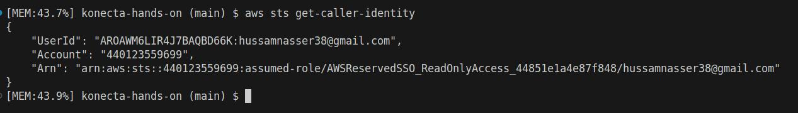

# Konecta AWS DRIVE 
# AWS Infrastructure as Code Project

This project manages AWS infrastructure using Terraform, implementing a multi-module approach to handle various AWS services including VPC, IAM, S3, and CloudWatch Alarms.

## Project Structure

```
.
├── main.tf              # Main Terraform configuration
├── vars.tf             # Root variables definition
└── modules/
    ├── cloudwatch-alarms/  # CloudWatch Alarms configuration
          import.sh
          alarms.tf
          vars.tf
          outputs.tf
    ├── iam/               # IAM roles and policies
          import.sh
          policies/
          iam.tf
          roles.txt
          vars.tf
          outputs.tf
    ├── s3/               # S3 buckets configuration
          import.sh
          s3.tf
          vars.tf
          outputs.tf
          versions.tf
    └── vpc/              # VPC networking components
          import.sh
          vpc.tf
          vars.tf
          outputs.tf
          versions.tf
```

## Prerequisites

- AWS CLI configured with appropriate credentials
- Terraform ~> 1.0
- AWS provider ~> 6.0

## Task Requirements

1. Install and configure AWS CLI v2 and Terraform.  
2. Discover all resources in my AWS account.  
3. Import resources into Terraform state.  
4. Write Terraform code to represent those resources.  
5. Verify with `terraform plan` that there are no changes required.

## 1. AWS Login
- Used the credentials provided in my email to log in at:  
  👉 [AWS Console](https://console.aws.amazon.com)

---

## 2. Configure AWS CLI
1. Install the [AWS CLI v2](https://docs.aws.amazon.com/cli/latest/userguide/getting-started-install.html).
2. Run the following command in your terminal (PowerShell on Windows, or Terminal on Mac/Linux):

   ```bash
   aws configure
   ```

   Enter the following values (from your email credentials):
   - **AWS Access Key ID**
   - **AWS Secret Access Key**
   - **Default region:** `eu-west-1`  
   - **Output format:** `json`

3. Test your configuration with:
   ```bash
   aws sts get-caller-identity
   ```


---

## 3. Install Terraform
1. install Terraform from the [official installation page](https://developer.hashicorp.com/terraform/install).
2. Verify installation:
   ```bash
   terraform -version
   ```

---

## 4. Install Visual Studio Code
- Download and install [VS Code](https://code.visualstudio.com/).
- Install the following extensions:
  - **HashiCorp Terraform**

---

## Modules

### VPC Module
- Creates and manages VPC resources in the SA-EAST-1 region
- Supports multiple subnets with customizable CIDR blocks
- Handles route tables and internet gateways
- Includes import functionality for existing resources

### IAM Module
- Manages IAM roles with trust relationships
- Supports automatic policy document importing
- Handles role tags for QuickSetup resources
- Limited to first 10 roles for manageability

### S3 Module
- Creates and manages S3 buckets across regions
- Supports custom tagging based on bucket purpose
- Handles both default and specific bucket configurations
- Includes separate configuration for US-EAST-1 region

### CloudWatch Alarms Module
- Configures metric alarms with customizable parameters
- Supports various alarm configurations and thresholds
- Includes import functionality for existing alarms

## Usage

1. Initialize Terraform:
```bash
terraform init
```

2. Import existing resources (optional):
```bash
# For VPC resources
./modules/vpc/import.sh

# For IAM roles
./modules/iam/import.sh

# For S3 buckets
./modules/s3/import.sh

# For CloudWatch alarms
./modules/cloudwatch-alarms/import.sh
```

3. Plan and apply changes:
```bash
terraform plan
terraform apply
```

## Variables

The project uses various variables defined in `vars.tf`. Key variables include:

- `region`: AWS region for resource deployment
- `vpc_cidr`: CIDR block for VPC
- `bucket_names`: List of S3 bucket names
- `iam_roles`: Set of IAM role names
- `cloudwatch_alarms`: Map of CloudWatch alarm configurations

## Provider Configuration

The project uses multiple provider configurations:
- Default region (defined by `var.region`)
- US-EAST-1 for specific S3 buckets
- SA-EAST-1 for VPC resources

## Tags

Resources are tagged according to the following scheme:
- Country
- Platform
- Project
- Special tags for QuickSetup resources

## Notes

- The project includes automatic importing of existing resources
- Sensitive files are excluded via .gitignore
